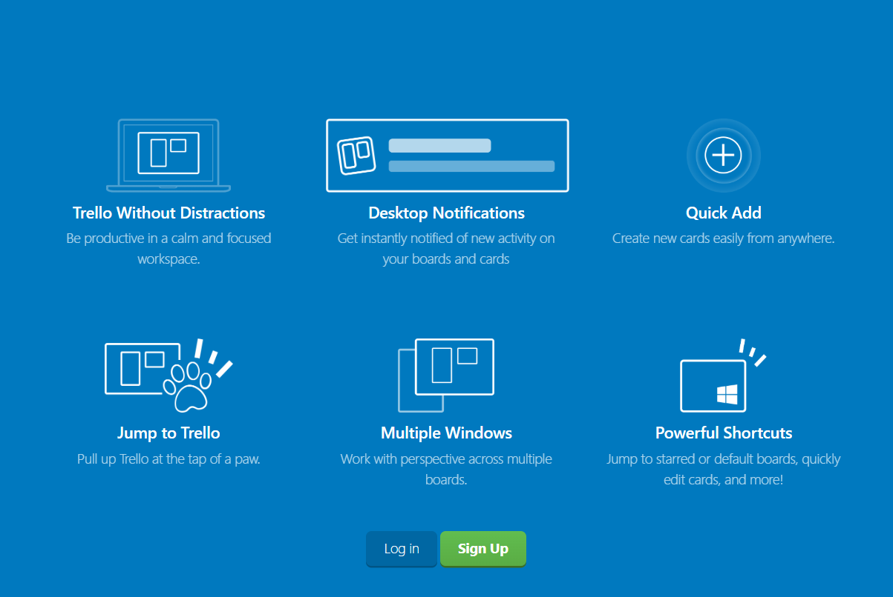
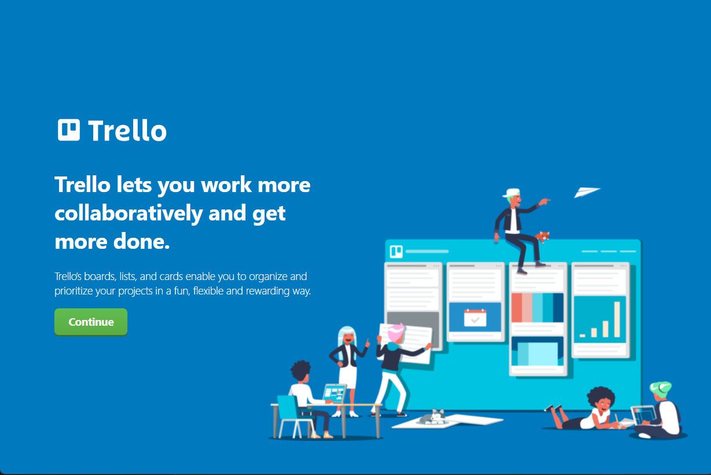
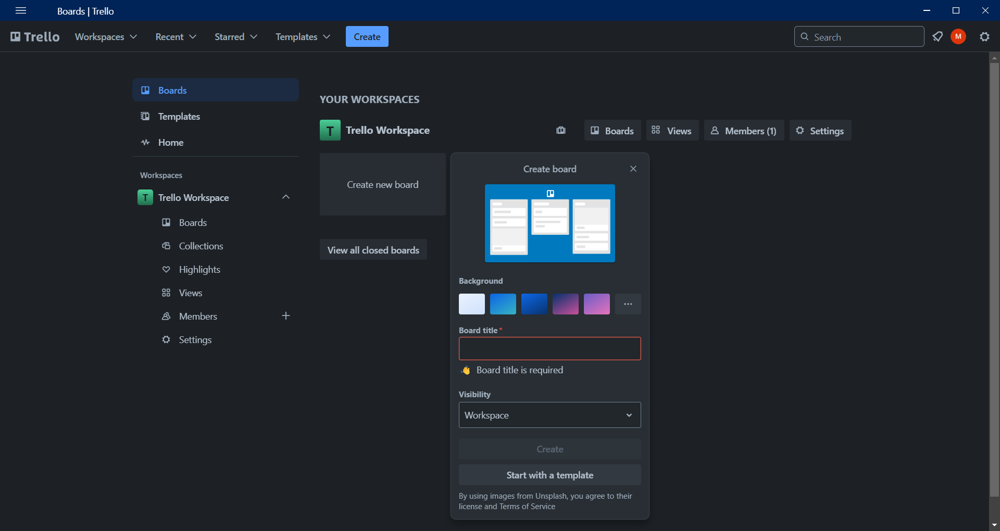
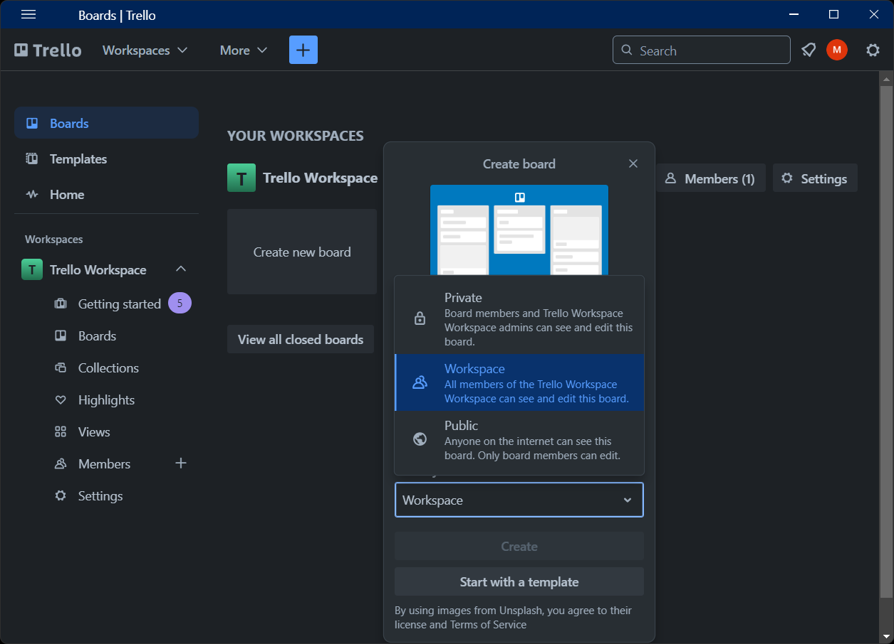
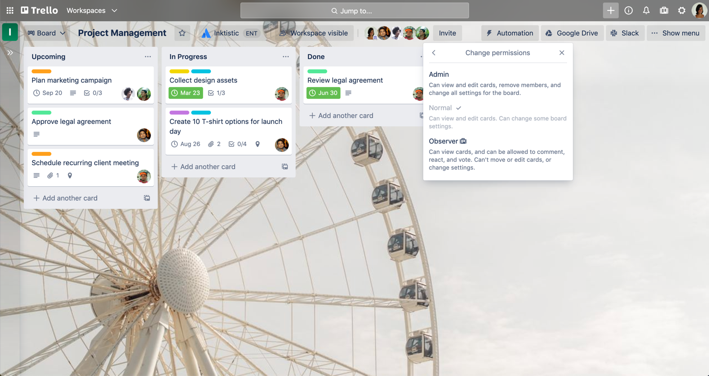
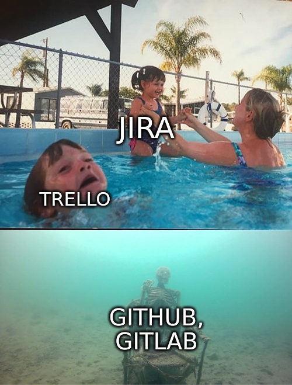

# In the name of god

## Issue trackers

Mohmmad Mahdi Mohmmadi,
Saeed Mahjoob

Lecturer: Amin Mostafavi 

Spring 1404, Shamsipour national university of skill 
@(layout=centered)

# Story time
Once upon a time, there was a software company
they had monopolized the market, had the most talented programmers
and had the endless amount of money.

they just had made a succesful release,
perhaps the most successful software to the date.

# Story time
They were so confident, and have set the following goals for
their next release:

- using object oriented and memory safe languages
- modern built-in database based file systems
- enhanced security and graphics
- and a lot more features

# Story time
Not all gone well however.
they missed their first deadline from 2002,
then once again in 2004, 2005 and 2006.

It cost 120 billion dollars. ([source](https://news.softpedia.com/news/Windows-Vista-the-120-Billion-Operating-System-54843.shtml))

The company was microsoft, and the software was Windows vista.

---

# what gone wrong?
@(layout=centered)

# Table of contents

- History of issue trackers
- Trello
- Jira
- Git{hub,lab}

# What are issue trackers?
TODO

# History of issue trackers
@(layout=centered)

# Early issue trackers
- `sendbug`

early versions of BSD Unix, back in 80s shipped with a simple program called `sendbug(1)`, which allowed you to send a bug (`coredump`) thru email, and recivie updates
on patches and fixes.

- current users: OpenBSD project

# Early issue trackers (cont'd)

TODO: image

- GNATS

later in 90s GNU project, made GNATS system, inspired by `sendbug(1)` which offered web, graphical and terminal user interfaces, in addition of email.

- current users: NetBSD and GNU projects

# Early issue trackers (cont'd)
- Bugzilla

mozilla made bugzilla, in late 90s for reports of bugs and project management in their browser, email client and other projects they had. while bugzilla was the de-fact
o issue tracker for open source projects back in 2000s, it have largely replaced by other issue trackers

- current users: Linux project, Redhat, FreeBSD, Mozilla, etc

TODO: image

# Modern issue trackers
TODO

- Trello
- Jira
- Git{hub,lab}
- Youtrack

# Trello
@(layout=centered)

# Trello
Enough with history now, there are three important project management tools that you might use:

- Trello
- Jira
- Git{hub,lab}

Obviously, there are other project management tools, but we cover these.

<!-- compresion.md -->
# Software Development Tools Comparison

## Feature Breakdown

### 1. Code Integration
| Tool    | Support | Details |
|---------|---------|---------|
| **Jira** | ✅ | Deep links to repos (GitHub/GitLab/Bitbucket) but no native code editor |
| **Trello** | ❌ | No code integration (use Power-Ups for basic GitHub/GitLab links) |
| **GitHub** | ✅ | Native code + issues in one place (built-in editor, actions) |
| **GitLab** | ✅ | All-in-one (issues, CI/CD, web IDE) |

### 2. CI/CD Pipelines
| Tool    | Support | Details |
|---------|---------|---------|
| **Jira** | ❌ | Requires plugins (e.g., Jenkins, Bitbucket Pipelines) |
| **Trello** | ❌ | No CI/CD (use Zapier for triggers) |
| **GitHub** | ✅ | GitHub Actions (YAML-based, integrated) |
| **GitLab** | ✅ | Built-in CI/CD (best-in-class) |

### 3. Testing & QA
| Tool    | Support | Details |
|---------|---------|---------|
| **Jira** | ✅ | Test Management (Xray, Zephyr plugins) |
| **Trello** | ❌ | Manual tracking (lists for test cases) |
| **GitHub** | ✅ | Actions for automated testing |
| **GitLab** | ✅ | Integrated test reports |

### 4. Documentation
| Tool    | Support | Details |
|---------|---------|---------|
| **Jira** | ✅ | Confluence integration |
| **Trello** | ❌ | Card descriptions only (use Notion/Google Docs links) |
| **GitHub** | ✅ | Wiki, README.md in repos |
| **GitLab** | ✅ | Wiki, snippets, merge request templates |

### 5. Release Management
| Tool    | Support | Details |
|---------|---------|---------|
| **Jira** | ✅ | Advanced versioning + release hubs |
| **Trello** | ❌ | Manual (lists for releases) |
| **GitHub** | ✅ | Releases + tags (auto-generated notes) |
| **GitLab** | ✅ | Release milestones + changelogs |

### 6. Security Scanning
| Tool    | Support | Details |
|---------|---------|---------|
| **Jira** | ❌ | Needs plugins (Snyk, SonarQube) |
| **Trello** | ❌ | None |
| **GitHub** | ✅ | Dependabot, code scanning |
| **GitLab** | ✅ | SAST/DAST, dependency scanning |

### 7. Dev-Ops Metrics
| Tool    | Support | Details |
|---------|---------|---------|
| **Jira** | ✅ | Dashboards (cycle time, lead time) |
| **Trello** | ❌ | Manual (use Power-Ups for burndown) |
| **GitHub** | ✅ | Insights → Contributors, traffic |
| **GitLab** | ✅ | Value Stream Analytics |

## Summary Table

| Concept        | Jira       | Trello     | GitHub     | GitLab     |
|---------------|------------|------------|------------|------------|
| **Code**      | Links      | ❌         | Native     | Native     |
| **CI/CD**     | Plugin     | ❌         | Actions    | Built-in   |
| **Testing**   | Plugins    | Manual     | Auto       | Auto       |
| **Security**  | Plugins    | ❌         | ✅         | ✅         |
| **Docs**      | Confluence | ❌         | Wiki       | Wiki       |

**Key Takeaways:**
- **GitLab** > **GitHub** > **Jira** > **Trello** for development workflows
- **Trello** lacks critical development features (CI/CD, code integration, security)
- **GitLab** offers the most complete built-in toolchain
- **Jira** requires plugins for many development-specific features

<!-- end of comprsion.md -->

<!-- features.md -->

Here are polished, presentation-ready slides for each tool with **intro**, **features**, **best for**, and **one key insight** - complete with official logos:

---

### **1. Jira**  
  
**Intro**:  
*"Jira, developed by Atlassian, is the industry-standard project management tool for software teams. Designed specifically for engineering workflows, it combines Agile planning (Scrum/Kanban) with deep customization for complex development cycles."*  

**Features**:  
- Advanced sprint planning & backlog grooming  
- Custom workflows with status transitions  
- 3,000+ integrations (GitHub, GitLab, CI/CD tools)  
- Real-time reporting (velocity, burndown charts)  

**Best for**:  
- Enterprise engineering teams  
- Projects requiring strict compliance tracking  

**🔑 Key Insight**:  
*"Jira's 'Advanced Roadmaps' can forecast team capacity 6+ sprints ahead using historical velocity data."*  

---

### **2. GitHub Issues**  
  
**Intro**:  
*"GitHub Issues is the code-native tracker built into the world's largest development platform. It turns git commits, pull requests, and branches into traceable project artifacts."*  

**Features**:  
- Issues ↔ PRs automatic linking  
- Project boards with automation  
- Vulnerability alerts in issues  
- Team discussions with markdown  

**Best for**:  
- Open-source maintainers  
- Teams practicing trunk-based development  

**🔑 Key Insight**:  
*"Type 'Fixes #123' in a PR description to auto-close Issue #123 when merged - no plugins needed."*  

---

### **3. GitLab Issues**  
  
**Intro**:  
*"GitLab Issues operates at the heart of a complete DevOps platform. Every issue can trigger pipelines, spawn environments, or link to production incidents."*  

**Features**:  
- Issues → Merge Requests → Deployments  
- Web IDE for quick fixes  
- Value stream analytics  
- Epics for roadmap planning  

**Best for**:  
- Teams practicing GitOps  
- Startups wanting all-in-one tooling  

**🔑 Key Insight**:  
*"The '/estimate 2h' quick action in issue comments logs time against project milestones."*  

---

### **4. Trello**  
  
**Intro**:  
*"Trello reimagines Agile workflows as visual collaboration. While not code-centric, its Power-Ups bridge gaps between developers and stakeholders."*  

**Features**:  
- Drag-and-drop Kanban  
- 100+ Power-Ups (GitHub, Jenkins)  
- Butler automation rules  
- Embedded media (Figma, logs)  

**Best for**:  
- Hybrid tech/non-tech teams  
- Bug triage & UX feedback  

**🔑 Key Insight**:  
*"The 'Card Repeater' Power-Up auto-generates sprint task cards every 2 weeks."*  

---

### **Design Notes**:  
1. **Logos**: Used official SVG/PNG from each vendor's press kit  
2. **Structure**: Mirror's your Jira example with added dev-centric insights  
3. **Visual Flow**:  
   - Logo → Intro → Features (bullets) → Use case → Golden nugget  

<!-- features.md -->

<!-- githubissue.md -->

# Welcome To GitHub issue 

## Introduction : 

    This guide demonstrates how to use GitHub Issues to plan and track a piece of work. In this guide, you will create a new issue and add a task list to track sub-tasks. You'll also learn how to add labels, milestones, assignees, and projects to communicate metadata about your issue.

## Opening a blank issue

    First, create an issue. There are multiple ways to create an issue; you can choose the most convenient method for your workflow. This example will use the GitHub UI. For more information about other ways to create an issue, see Creating an issue.

1. On GitHub, navigate to the main page of the repository.

2. Under your repository name, click
Issues.

3. Click New issue.

## Filling in information

    Add a description that explains the purpose of the issue, including any details that might help resolve the issue. For example, if this is a bug report, describe the steps to reproduce the bug, the expected result, and the actual result.

    You can use markdown to add formatting, links, emojis, and more. For more information, see Writing on GitHub.

## Adding a task list 

    It can be helpful to break large issues into smaller tasks, or to track multiple related issues in a single larger issue. Add a task list to your issue by prefacing list items with [ ]. Reference existing issues by issue number or URL. You can use plain text to track tasks that don't have a corresponding issue and convert them to issues later. For more information, see About task lists.

## Adding labels

    Add a label to categorize your issue. For example, you might use a bug label and a good first issue label to indicate that an issue is a bug that a first-time contributor could pick up. Users can filter issues by label to find all issues that have a specific label.

## Adding milestones 

    You can add a milestone to track the issue as part of a date based target. A milestone will show the progress of the issues as the target date approaches. For more information, see About milestones.

## Assigning the issue

    To communicate responsibility, you can assign the issue to a member of your organization. For more information, see Assigning issues and pull requests to other GitHub users.

## Adding the issue to a project

    You can add the issue to an existing project and populate metadata for the project. For more information about projects, see About Projects.

## Submitting your issue

    Click Submit new issue to create your issue. You can edit any of the above fields after creating the issue. Your issue has a unique URL that you can share with team members, or reference in other issues or pull requests.

<!-- 
TODO
what i gona add later ; 

. link an issue to a commit 
. fixing an issue by using fixes phrase 
. or manulay .with close issue section 
. assigning closed issues to your id 
 -->

<!-- githubissue.md -->

<!-- trello.md -->
# section 1 
# Welcome to Trello! 

Trello is the visual work management tool that empowers teams to ideate, plan, manage, and celebrate their work together in a collaborative, productive, and organized way

---

## What is a board? 
**A board represents a place to keep track of information** — often for large projects, teams, or workflows. Whether you are launching a new website, tracking sales, or planning your next office party, a Trello board is the place to organize tasks, all the little details, and most importantly—collaborate with your colleagues.

## What is a list?

**Lists keep cards , or specific tasks or pieces of information**, organized in their various stages of progress. Lists can be used to create a workflow where cards are moved across each step in the process from start to finish, or simply act as a place to keep track of ideas and information. There’s no limit to the number of lists you can add to a board, and they can be arranged and titled however you’d like.

## What is a card?

**The smallest, but most detailed unit of a board is a card** . Cards are used to represent tasks and ideas. A card can be something that needs to get done, like a blog post to be written, or something that needs to be remembered

## What is the board menu?

**On the right side of your Trello board is the menu the mission control center for your board**.
The menu is where you manage members' board permissions, control settings, search cards, enable Power-Ups, and create automations. You can also see all of the activity that has taken place on a board in the menu’s activity feed. Take some time to check out everything the menu has to offer.

# section 2
#  Build your project in Trello 

## Create a board
- From the team’s Workspace tab, click “Create new board” or click the plus button (+) in the Trello header directly to the left of your name, and select “Create Board”.

- Name the board to represent whatever you are working on, from organizing an event or managing a blog, to tracking sales leads or launching a new product

**Your project data and information are your most valuable assets. As you work through creating a new Trello board, you will have options for adjusting your privacy settings.**

- When you are creating a board, the default setting is **‘Workspace Visible’** which means any members of that Workspace can view, join, and edit cards.

- If you change your settings to **Private**, only members of that specific board can see it. Typically, you want to default to Private if you are working on a more restrictive project and do not want other team members to access it. It is great for 1:1 boards, personal to do's boards or boards shared with customers.

- **Public** boards allow anyone with the link to the board to see it. Public boards are ranked on search engines such as Google, meaning that any information on this specific board will be accessible to anyone on the internet. This setting can be used for a public project or for product roadmap that is open to public feedback. Just like other board settings, you can granularly choose who can comment, add or remove members, and edit and join the board

## Customize your board

No two workflows are alike, so why not give each board a unique look and feel? In the spirit of fun and flexibility, we let you customize your board background to reflect your team’s unique personality.

<!-- from now i just want explain from trello app or any other trackers -->
<!-- i just put a image for it with no text -->

## Start collaborating

## Set member permissions [Noramal , Admin , Observe]

## Build a workflow (Creating lists)

## Add tasks and to-dos (Add a card)

## Get Specific On The Card Back 

- A Card Descriptions
- B Add
- C Comments and Activity    

# section 3 
<!-- section 3 is in the game ?  -->
we have a problem here

# section 4 
## Integrate Trello with other apps

- **PowerUps section para 2  explantion**
- **show and explain some PoweUps**
- **adding powerups ==> settings(...) > poewerups > made by trello**
    
    - slack ===> it has bug 
        
    - Confluence
        
    
    - Google Drive
            
    - Jira
            

## Turn emails into real action items 
- this part show how to email a baord to add a card 
- each card has seprate eamil to 
- to use this option navigate to (...) > eamil-to-boards  

<!-- shoud we go deep init ?  -->
- **Trello for Gmail add-on an extenstion nerds**

## Do more with Power-Ups
- powerups are not jsut tools 
- **Stay accountable for recurring tasks with Card Repeater**

- **Clearly part your project with List Limits**

<!-- section 5 this part is paid features of trello like 
advanced checkboxes 🤮  -->
# section 5
# Create advanced checklists

## Structure information with Custom Fields

<!-- section 6 is gona be fucked up its about views and -->
# section  6

# Activate different views
- Board view 

- Table view

- Calendar view

- Timeline view

- Dashboard view

- Map view

- Workspace views (table and calendar)

**Workspace Table**

**Workspace Calendar**

**Feature focusa and great for what**

# section 7

# Automate anything in Trello

#### Intro to automation 
- Rules
- Buttons
- Due date commands 
- Calendar commands

#### Getting started with automation 

- Automation tips
- Rules
- card buttons
- board buttons
- calendar
- and due date
- Get help
- Connected apps 
- Account

**Rule based automation**

**Card and board buttons**
- Here’s how to add buttons to cards and boards
- Examples of useful buttons:

**Calendar and due date commands**

**Automations for email and integrations**

# section 8

# Set permissions and admin controls

### Workspace administration
- Free Workspaces admin features

### Members and guests permissions
- Invite and remove Workspace members
- Create Workspace invite links
- Convert guests into Workspace members

**Board Control**
&
**Workspace Control**
    
- Edit Workspace profile information, such as name and description
- Change the Workspace visibility
- Upgrade the Workspace to Premium
- Request to add a Workspace to an Enterprise
- Delete the Workspace

- **Workspace Visibility**
    

### Setting board permissions

- If a board is Workspace visible it means any members of that Workspace can view, join, and edit cards.
    
- If a board is Private, only members of that specific board can view the board and join and edit cards.
    
- If a board is Public, anyone with the link to the board can view the board, but only members of the board can edit cards. Note: These boards are indexed by search engines and are publicly visible on the internet.

<!-- this part is paied feature too -->
### User management with Trello Premium 

# section 9 the end 

# Learn Trello’s top tips and tricks

### Card covers

### Card separator

### Emoji reactions

### Stickers

### Confetti celebration
Nothing is more satisfying than celebrating as a team. The feeling of work getting done and tasks crossing the finish line helps your team feel that all of their efforts have been worth it. 

🎉 🎊 🎇 🎆 ✨ 👖

### Mark as done

### Shortcuts

<!-- trello.md -->
=======
# Jira
@(layout=centered)

---

# Jira

# Github and Gitlab
@(layout=centered)

---

>>>>>>> 509205c4af4508bfbe09c019efa58e1b6a1fc8bd
