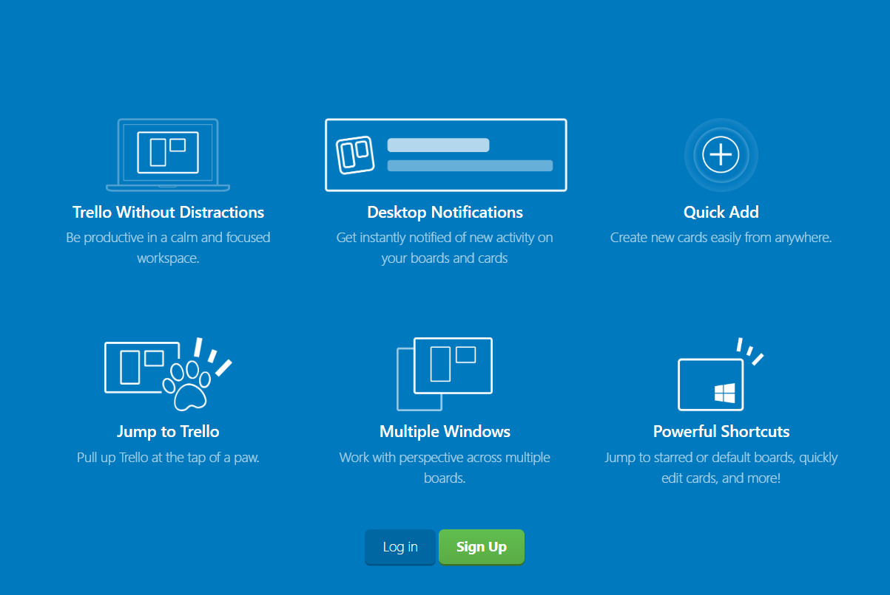
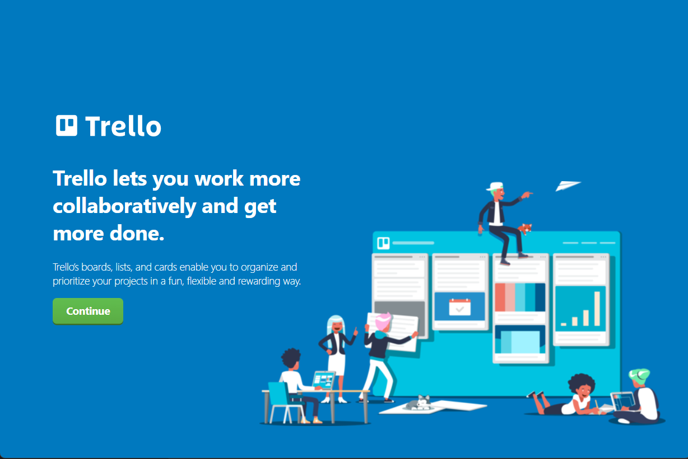
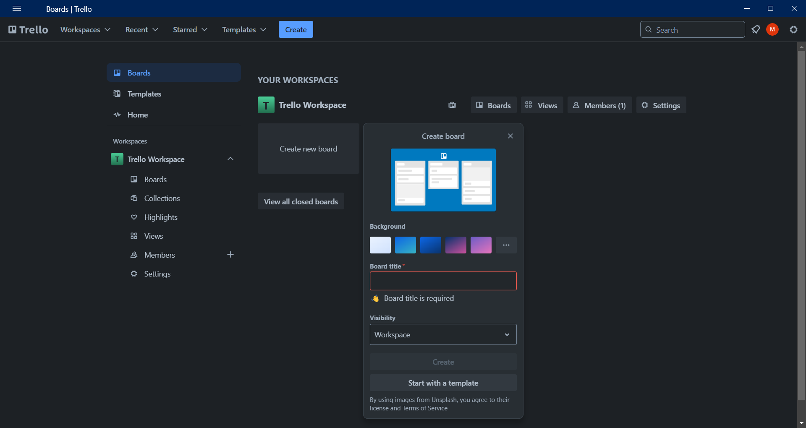

# section 1 
# Welcome to Trello! 

Trello is the visual work management tool that empowers teams to ideate, plan, manage, and celebrate their work together in a collaborative, productive, and organized way

## What is a board? 
**A board represents a place to keep track of information** — often for large projects, teams, or workflows. Whether you are launching a new website, tracking sales, or planning your next office party, a Trello board is the place to organize tasks, all the little details, and most importantly—collaborate with your colleagues.

## What is a list?

**Lists keep cards , or specific tasks or pieces of information**, organized in their various stages of progress. Lists can be used to create a workflow where cards are moved across each step in the process from start to finish, or simply act as a place to keep track of ideas and information. There’s no limit to the number of lists you can add to a board, and they can be arranged and titled however you’d like.

## What is a card?

**The smallest, but most detailed unit of a board is a card** . Cards are used to represent tasks and ideas. A card can be something that needs to get done, like a blog post to be written, or something that needs to be remembered

## What is the board menu?

**On the right side of your Trello board is the menu the mission control center for your board**.
The menu is where you manage members' board permissions, control settings, search cards, enable Power-Ups, and create automations. You can also see all of the activity that has taken place on a board in the menu’s activity feed. Take some time to check out everything the menu has to offer.

# section 2
#  Build your project in Trello 

## Create a board
- From the team’s Workspace tab, click “Create new board” or click the plus button (+) in the Trello header directly to the left of your name, and select “Create Board”.

- Name the board to represent whatever you are working on, from organizing an event or managing a blog, to tracking sales leads or launching a new product

**Your project data and information are your most valuable assets. As you work through creating a new Trello board, you will have options for adjusting your privacy settings.**

- When you are creating a board, the default setting is **‘Workspace Visible’** which means any members of that Workspace can view, join, and edit cards.

- If you change your settings to **Private**, only members of that specific board can see it. Typically, you want to default to Private if you are working on a more restrictive project and do not want other team members to access it. It is great for 1:1 boards, personal to do's boards or boards shared with customers.

- **Public** boards allow anyone with the link to the board to see it. Public boards are ranked on search engines such as Google, meaning that any information on this specific board will be accessible to anyone on the internet. This setting can be used for a public project or for product roadmap that is open to public feedback. Just like other board settings, you can granularly choose who can comment, add or remove members, and edit and join the board

## Customize your board

No two workflows are alike, so why not give each board a unique look and feel? In the spirit of fun and flexibility, we let you customize your board background to reflect your team’s unique personality.

<!-- from now i just want explain from trello app or any other trackers -->
<!-- i just put a image for it with no text -->

## Start collaborating

## Set member permissions [Noramal , Admin , Observe]

## Build a workflow (Creating lists)

## Add tasks and to-dos (Add a card)

## Get Specific On The Card Back 

- A Card Descriptions
- B Add
- C Comments and Activity    

# section 3 
<!-- section 3 is in the game ?  -->
we have a problem here

# section 4 
## Integrate Trello with other apps

- **PowerUps section para 2  explantion**
- **show and explain some PoweUps**
- **adding powerups ==> settings(...) > poewerups > made by trello**
    
    - slack ===> it has bug 
        
    - Confluence
        
    
    - Google Drive
            
    - Jira
            

## Turn emails into real action items 
- this part show how to email a baord to add a card 
- each card has seprate eamil to 
- to use this option navigate to (...) > eamil-to-boards  

<!-- shoud we go deep init ?  -->
- **Trello for Gmail add-on an extenstion nerds**

## Do more with Power-Ups
- powerups are not jsut tools 
- **Stay accountable for recurring tasks with Card Repeater**

- **Clearly part your project with List Limits**

<!-- section 5 this part is paid features of trello like 
advanced checkboxes 🤮  -->
# section 5
# Create advanced checklists

## Structure information with Custom Fields

<!-- section 6 is gona be fucked up its about views and -->
# section  6

# Activate different views
- Board view 

- Table view

- Calendar view

- Timeline view

- Dashboard view

- Map view

- Workspace views (table and calendar)

**Workspace Table**

**Workspace Calendar**

**Feature focusa and great for what**

# section 7

# Automate anything in Trello

#### Intro to automation 
- Rules
- Buttons
- Due date commands 
- Calendar commands

#### Getting started with automation 

- Automation tips
- Rules
- card buttons
- board buttons
- calendar
- and due date
- Get help
- Connected apps 
- Account

**Rule based automation**

**Card and board buttons**
- Here’s how to add buttons to cards and boards
- Examples of useful buttons:

**Calendar and due date commands**

**Automations for email and integrations**

# section 8

# Set permissions and admin controls

### Workspace administration
- Free Workspaces admin features

### Members and guests permissions
- Invite and remove Workspace members
- Create Workspace invite links
- Convert guests into Workspace members

**Board Control**
&
**Workspace Control**
    
- Edit Workspace profile information, such as name and description
- Change the Workspace visibility
- Upgrade the Workspace to Premium
- Request to add a Workspace to an Enterprise
- Delete the Workspace

- **Workspace Visibility**
    

### Setting board permissions

- If a board is Workspace visible it means any members of that Workspace can view, join, and edit cards.
    
- If a board is Private, only members of that specific board can view the board and join and edit cards.
    
- If a board is Public, anyone with the link to the board can view the board, but only members of the board can edit cards. Note: These boards are indexed by search engines and are publicly visible on the internet.

<!-- this part is paied feature too -->
### User management with Trello Premium 

# section 9 the end 

# Learn Trello’s top tips and tricks

### Card covers

### Card separator

### Emoji reactions

### Stickers

### Confetti celebration
Nothing is more satisfying than celebrating as a team. The feeling of work getting done and tasks crossing the finish line helps your team feel that all of their efforts have been worth it. 

🎉 🎊 🎇 🎆 ✨ 👖

### Mark as done

### Shortcuts

